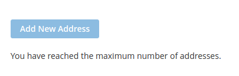

Restricts the number of possible customer address to be created.

#Functionality.
## Personal Account. Address Grid.
The button is blocked. The notification message is shown. Additional verification on the backend side.
(Original template wasn't replaced)



## Stores Configuration. 


# ENV variables.
To configure max number you may use following ENV variable:
```shell
CONFIG__DEFAULT__CUSTOMER__ADDRESS__MAX_NUMBER=5

```

# Endpoints.

GET /V1/customers/me/addresses/canCreate

# Additional info.

Covered with Unit and Api-functional test
